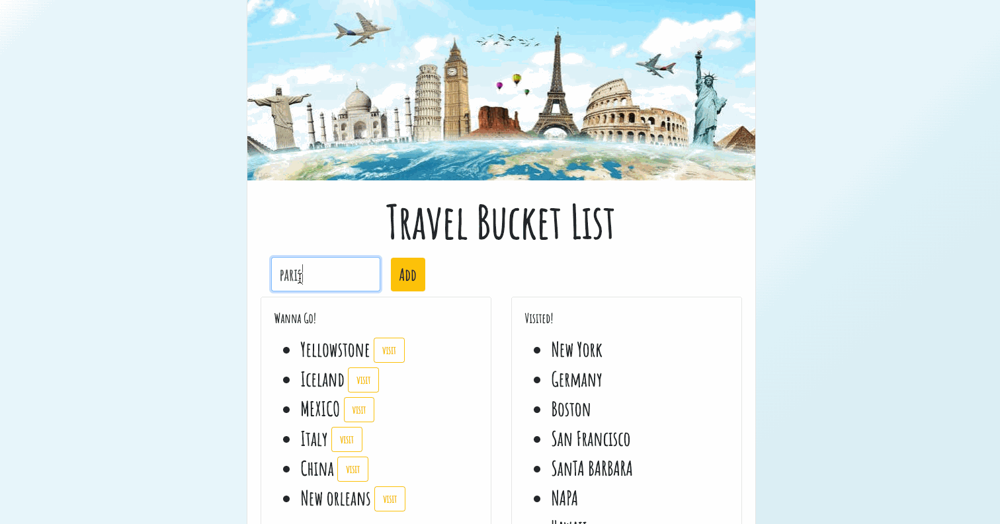

# Travel Bucket list

## Description
Travel Bucket list application allows users to create and update a travel bucket list.

This application is buit with MySQL to query and route data, Node, Express, Handlebars to generate the HTML. 

## Heroku link to the deployed application
[Travel Bucket list](https://travel-bucketlist.herokuapp.com/?)

## Demo

## Technologies Used
- JavaScript 
- Node and NPM
- Handlebar
- Express
- mySQL
- Bootstrap
- CSS
- Git - version control system to track changes to source code
- Heroku - to host the application and the database

